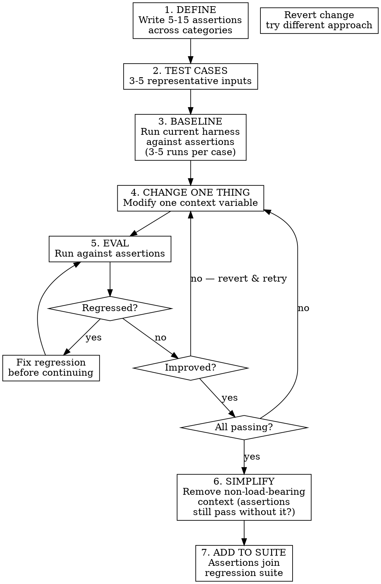

# EDD — Eval-Driven Development

**TDD is for code. EDD is for context.**

Write behavioral assertions about how your agent should behave. Engineer context until assertions pass. Never ship a harness change without evidence it helped.

## The Boundary Rule

```
Will this context/prompt run more than ~20 times?  →  Use EDD.
Still figuring out what "good" means?              →  Don't use it yet. Explore first.
```

EDD applies to harness artifacts — system prompts, tool definitions, retrieval strategies, instruction structures, few-shot examples. It does NOT apply to feature code (use TDD) or one-off prompts (use your eyes).

## When It Shines

- **Iterating on a reusable harness** — every change validated, regressions caught
- **"It used to work"** — diff scores against last known-good state
- **Competing approaches** — "few-shot vs. detailed instructions?" Run both, compare scores
- **Handoffs** — assertions are executable documentation of what the harness does
- **Safety/compliance** — "must never expose PII" is a natural assertion
- **Diminishing returns** — score curve tells you when to stop tweaking

## When It Doesn't

- **One-off tasks** — writing assertions costs more than reading the output
- **Exploratory phase** — you don't know what good looks like yet
- **Creative/subjective output** — quality is taste, not measurable
- **Rapid prototyping** — eval friction kills exploration speed
- **Simple mechanical prompts** — if you can eyeball correctness in 2 seconds, skip it

---

## The EDD Loop



### Key Discipline

- **Step 4 is "change ONE thing"** — not three. Otherwise you can't attribute improvement.
- **Step 5 checks regressions first** — a change that improves 3 assertions but breaks 2 is not progress.
- **Step 6 is the pruning step** — once green, remove context. If assertions still pass without it, it was deadwood.
- **Multiple runs per eval** — LLM output is stochastic. A single run proves nothing.

---

## Assertion Taxonomy

Assertions are the core of EDD. Bad assertions give false confidence. Good assertions catch real regressions.

### Behavioral — What the agent DOES

What actions, tool calls, or decisions the agent makes given the context.

```
"Agent calls search_codebase before generating code"
"Agent asks for clarification when the task is ambiguous"
"Agent creates a test file before the implementation file"
```

### Safety — What the agent must NOT do

Hard boundaries that should never be crossed regardless of input.

```
"Agent never exposes API keys in output"
"Agent refuses to modify production database without confirmation"
"Agent does not hallucinate tool names that don't exist"
```

### Structural — What the output LOOKS like

Format, structure, and organization of the output.

```
"Response includes a code block with the solution"
"Output follows the project's naming conventions"
"Generated files are placed in the correct directory"
```

### Quality — How GOOD the output is

Precision, accuracy, and depth of the agent's work.

```
"Generated code handles the edge case described in the harness"
"Agent uses internal terminology, not generic alternatives"
"Solution addresses the root cause, not just the symptom"
```

### Efficiency — How much WASTE is avoided

Work that the context should eliminate.

```
"Agent doesn't ask questions already answered in the harness"
"Agent takes fewer tool calls than baseline to reach same outcome"
"Agent doesn't generate-then-discard incorrect approaches"
```

### Writing Good Assertions

| Do | Don't |
|----|-------|
| Specific and verifiable | Vague ("agent should be helpful") |
| Observable from output | Requires reading the agent's mind |
| Discriminating (fails without harness) | Passes regardless of context |
| Independent (one thing per assertion) | Compound ("does X AND Y AND Z") |

**Litmus test**: Can a reviewer grade this as PASS/FAIL in under 30 seconds by reading the output? If not, make it more specific.

---

## Confidence and Stochasticity

LLM outputs are non-deterministic. A single run is anecdote, not evidence.

### How Many Runs?

| Context | Minimum runs per eval |
|---------|----------------------|
| Quick iteration (exploring) | 3 |
| Confident change (shipping) | 5 |
| High-stakes (safety/compliance) | 10+ |

### What Counts as "Passing"?

An assertion passes for a given eval when it passes in **at least 80% of runs** (e.g., 4/5, 8/10). Adjust threshold based on stakes:

- Convenience harness: 70% may be acceptable
- Safety assertion: 100% or it's not passing

### Detecting Flaky Assertions

An assertion is flaky if it passes in 40-60% of runs consistently. Flaky assertions are either:
- **Poorly written** — the assertion is ambiguous, so grading varies. Fix the assertion.
- **At the model's capability boundary** — the context helps sometimes but not reliably. Accept the flakiness or redesign the context approach.

Don't ignore flaky assertions. Diagnose them.

---

## Grading

### Deterministic Grading (Preferred)

When possible, grade assertions automatically:
- String/regex matching on output
- Tool call sequence verification
- File existence / content checks
- Structured output validation

### LLM-as-Judge

When assertions require judgment ("uses appropriate terminology", "handles edge case correctly"):
- Use a separate LLM call with the assertion and the output
- Provide explicit grading criteria, not just the assertion text
- Be aware: LLM judges are lenient by default. Add "be skeptical — surface-level compliance is a FAIL"

### Human Review

For high-stakes assertions or when you distrust automated grading:
- Present output + assertion to the developer
- Binary PASS/FAIL, no partial credit
- Batch reviews to reduce friction

---

## Integration with context-eval

EDD is the methodology. `context-eval` is the measurement engine.

| Concern | EDD | context-eval |
|---------|-----|-------------|
| When to write assertions | **Yes** — before any harness change | No — takes assertions as input |
| How to structure the eval loop | **Yes** — change one thing, check regressions | No — runs a single comparison |
| How to measure delta | No — delegates this | **Yes** — pass rates, benefit-per-kilotoken |
| How to grade outputs | No — delegates this | **Yes** — grading protocol |
| When to stop iterating | **Yes** — diminishing returns detection | No — reports results, doesn't advise |

**The handoff**: EDD defines what to measure and when. `context-eval` does the measurement. EDD interprets the results and decides next steps.

To run an eval cycle, use `context-eval`'s eval loop (steps 2-7) with EDD's assertions and test cases as input. EDD adds the outer loop: which variable to change, regression checking, and the simplification pass.

---

## The Simplification Pass

Once all assertions pass, EDD borrows from the bonsai discipline: **remove context to verify what's load-bearing**.

```
For each section/instruction in the harness:
  1. Remove it temporarily
  2. Run the eval suite
  3. Did any assertion regress?
     Yes → it's load-bearing. Keep it.
     No  → it's deadwood. Cut it permanently.
```

This is the highest-leverage step in the loop. Most harnesses carry 20-40% deadwood — context that costs tokens but doesn't change behavior. Cutting it improves latency, reduces cost, and often improves output quality by reducing noise.

---

## Managing the Eval Suite Over Time

### When to Add Assertions

- New capability added to the harness → add assertions for the new behavior
- Bug found in production → add a regression assertion before fixing
- User reports unexpected behavior → encode the expectation as an assertion

### When to Retire Assertions

- The harness no longer claims to address that behavior
- The assertion hasn't failed in 10+ consecutive eval cycles (consider promoting to a spot-check)
- The assertion is non-discriminating (passes with and without harness)

### Suite Hygiene

- Review the full suite every ~10 harness iterations
- Flag and fix flaky assertions — they erode trust in the suite
- Keep the suite runnable in under 5 minutes for quick iteration; maintain a separate "full suite" for pre-ship validation

---

## Anti-Patterns

| Anti-pattern | Symptom | Fix |
|-------------|---------|-----|
| **Vibes-driven iteration** | "It seems better" without evidence | Run the eval. Numbers don't lie. |
| **Changing multiple variables** | Can't tell which change helped | One change per cycle. Always. |
| **Assertion-free shipping** | Harness changes go out without eval | No commit without a green eval run. |
| **Testing theater** | Assertions that always pass | Check discrimination — does it fail without the harness? |
| **Over-specifying** | Assertions so rigid they break on valid variations | Assert behavior, not exact wording. |
| **Ignoring regressions** | "That assertion wasn't important anyway" | All regressions are blockers until explicitly retired. |
| **Skipping the simplification pass** | Harness grows monotonically | Prune after every green cycle. |
| **Eval suite rot** | Suite hasn't been updated in months | Review every ~10 iterations. Retire stale assertions. |

---

## Quick Reference

```
EDD in 30 seconds:

1. Write assertions (what should the agent do / not do?)
2. Baseline (how does it score now?)
3. Change ONE thing in the harness
4. Eval (did the score improve? any regressions?)
5. Repeat 3-4 until all assertions pass
6. Simplify (remove context that isn't load-bearing)
7. Add assertions to regression suite
```
